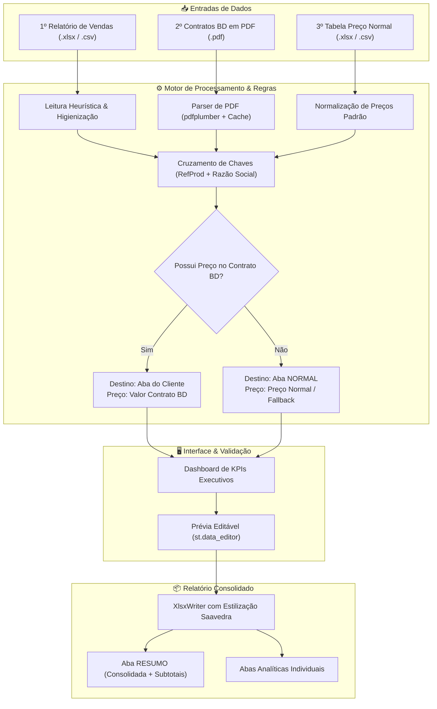

<!-- HEADER DO PROJETO -->
<div align="center">

  <h1>🎸 The Nehemizer</h1>
  <p><strong>Portal Financeiro & Equalizador de Contratos Hospitalares Saavedra N3</strong></p>

  <p>
    <em>“O peso justo e a organização perfeita para os seus contratos financeiros.”</em><br>
    <sub>(Inspirado em Provérbios 11:1 e na gestão administrativa de Neemias)</sub>
  </p>

  <p>
    <a href="https://the-nehemizer.streamlit.app/">
      
    </a>
  </p>

  <p>
    <a href="CHANGELOG.md">
      
    </a>
    
    
    
    
    
    
    
  </p>

</div>

<hr />

## 📌 Sumário Executivo

<div align="justify">

**The Nehemizer** é uma solução corporativa desenvolvida para a **Saavedra N3** com o objetivo de **automatizar, auditar e equalizar** a conciliação financeira de vendas e contratos de distribuição de materiais hospitalares (notadamente Becton Dickinson - BD).

A ferramenta substitui processos manuais repetitivos ao realizar o cruzamento automatizado entre:
1. **Relatórios Brutos de Vendas** (Excel / CSV com layouts dinâmicos);
2. **Propostas e Contratos Vigentes BD** (extração estruturada via OCR/PDF Parsing);
3. **Tabelas Padrão de Preços de Compra**.

O resultado é um painel executivo com prévia interativa e geração instantânea de planilhas auditáveis `.xlsx` no padrão visual corporativo Saavedra.

</div>

<br />

---

## ✨ Recursos & Diferenciais

<table width="100%">
  <thead>
    <tr>
      <th width="30%" align="left">Recurso</th>
      <th width="70%" align="left">Descrição e Benefício Operacional</th>
    </tr>
  </thead>
  <tbody>
    <tr>
      <td><strong>📄 Leitura Inteligente de Vendas</strong></td>
      <td>Detecção heurística automática da linha de cabeçalho e normalização flexível de colunas (<code>REFPROD</code>, <code>DESCRICAO</code>, <code>QTDCOM</code>, <code>VLRTOTAL</code>, <code>RAZAOSOCIAL</code>, <code>CONVENIO</code>), mesmo com variações de layout e <i>encodings</i> legados (UTF-8, Latin-1, CP1252).</td>
    </tr>
    <tr>
      <td><strong>📑 Parser de PDFs (Contratos BD)</strong></td>
      <td>Varredura direta com <code>pdfplumber</code> e <i>caching</i> inteligente para extrair produtos, códigos de referência e preços acordados (<code>VALOR_TABELADO_BD</code>) de propostas comerciais em PDF.</td>
    </tr>
    <tr>
      <td><strong>⚖️ Regra Suprema de Contingência</strong></td>
      <td>Classificação automatizada: produtos vinculados a contratos BD preservam seu valor de contrato e são direcionados às abas dos clientes; itens sem vínculo ou fora de contrato são transferidos para a aba <code>NORMAL</code>.</td>
    </tr>
    <tr>
      <td><strong>✏️ Prévia Interativa em Tempo Real</strong></td>
      <td>Tabela interativa via <code>st.data_editor</code> que permite ao analista financeiro revisar, completar e ajustar preços em branco antes da exportação definitiva.</td>
    </tr>
    <tr>
      <td><strong>📊 Exportação Contábil Multi-Aba</strong></td>
      <td>Geração com <code>XlsxWriter</code> contendo <strong>Aba RESUMO</strong> (visão executiva consolidada por cliente com subtotais e margens) e <strong>Abas Analíticas por Cliente</strong> com formatação nativa <code>R$ #,##0.00</code>.</td>
    </tr>
  </tbody>
</table>

<br />

---

## 🏛️ Fluxo e Arquitetura de Processamento

<div align="center">



</div>

<br />

---

## 📋 Mapeamento de Contratos & Clientes Reconhecidos

<div align="justify">

O sistema realiza a identificação automática de termos-chave e números de CNPJ na razão social para classificar os pedidos nos respectivos contratos:

</div>

<br />

<table width="100%">
  <thead>
    <tr>
      <th align="left">Cliente / Instituição</th>
      <th align="left">Termos e CNPJs Reconhecidos</th>
      <th align="center">Código Contrato BD</th>
      <th align="center">Aba Padrão</th>
    </tr>
  </thead>
  <tbody>
    <tr>
      <td><strong>UNIMED</strong></td>
      <td><code>UNIMED</code>, <code>87096616</code></td>
      <td align="center"><code>450128261</code></td>
      <td align="center"><span style="background-color:#EBF8FF;color:#2B6CB0;padding:2px 8px;border-radius:4px;font-size:0.85em;font-weight:bold;">UNIMED</span></td>
    </tr>
    <tr>
      <td><strong>PUC</strong></td>
      <td><code>UNIAO BRASILEIRA</code>, <code>PUC</code>, <code>88630413</code></td>
      <td align="center"><code>450155842</code></td>
      <td align="center"><span style="background-color:#EBF8FF;color:#2B6CB0;padding:2px 8px;border-radius:4px;font-size:0.85em;font-weight:bold;">PUC</span></td>
    </tr>
    <tr>
      <td><strong>H DIVINA</strong></td>
      <td><code>DIVINA</code>, <code>87317764</code></td>
      <td align="center"><code>450146829</code></td>
      <td align="center"><span style="background-color:#EBF8FF;color:#2B6CB0;padding:2px 8px;border-radius:4px;font-size:0.85em;font-weight:bold;">H DIVINA</span></td>
    </tr>
    <tr>
      <td><strong>HCPA</strong></td>
      <td><code>CLINICAS</code>, <code>87020517</code></td>
      <td align="center"><code>450139832</code></td>
      <td align="center"><span style="background-color:#EBF8FF;color:#2B6CB0;padding:2px 8px;border-radius:4px;font-size:0.85em;font-weight:bold;">HCPA</span></td>
    </tr>
    <tr>
      <td><strong>SMS POA</strong></td>
      <td><code>PORTO ALEGRE</code> + (<code>PREF</code> / <code>MUNICIPIO</code> / <code>92963560</code>)</td>
      <td align="center"><code>450120243</code></td>
      <td align="center"><span style="background-color:#EBF8FF;color:#2B6CB0;padding:2px 8px;border-radius:4px;font-size:0.85em;font-weight:bold;">SMS POA</span></td>
    </tr>
    <tr>
      <td><strong>EBSERH</strong></td>
      <td><code>EBSERH</code>, <code>SERVICOS HOSPITALARES</code>, <code>15126437</code></td>
      <td align="center"><code>450098658</code></td>
      <td align="center"><span style="background-color:#EBF8FF;color:#2B6CB0;padding:2px 8px;border-radius:4px;font-size:0.85em;font-weight:bold;">EBSERH</span></td>
    </tr>
    <tr>
      <td><strong>HCAA</strong></td>
      <td><code>ASTROGILDO</code>, <code>95610887</code></td>
      <td align="center"><code>450137626</code></td>
      <td align="center"><span style="background-color:#EBF8FF;color:#2B6CB0;padding:2px 8px;border-radius:4px;font-size:0.85em;font-weight:bold;">HCAA</span></td>
    </tr>
    <tr>
      <td><strong>GHC / CONCEIÇÃO</strong></td>
      <td><code>GHC</code>, <code>CONCEICAO</code>, <code>CONCEIÇÃO</code>, <code>450166419</code></td>
      <td align="center"><code>450166419</code></td>
      <td align="center"><span style="background-color:#EBF8FF;color:#2B6CB0;padding:2px 8px;border-radius:4px;font-size:0.85em;font-weight:bold;">CONCEICAO</span></td>
    </tr>
    <tr>
      <td><strong>SANTA CASA</strong></td>
      <td><code>SANTA CASA</code></td>
      <td align="center"><em>Sob Consulta</em></td>
      <td align="center"><span style="background-color:#EBF8FF;color:#2B6CB0;padding:2px 8px;border-radius:4px;font-size:0.85em;font-weight:bold;">SANTA CASA</span></td>
    </tr>
    <tr>
      <td><strong>FORA DE CONTRATO / OUTROS</strong></td>
      <td>Produtos sem correspondência de preço tabelado BD</td>
      <td align="center"><code>NORMAL</code></td>
      <td align="center"><span style="background-color:#FFF5F5;color:#C53030;padding:2px 8px;border-radius:4px;font-size:0.85em;font-weight:bold;">NORMAL</span></td>
    </tr>
  </tbody>
</table>

<br />

---

## 🚀 Como Executar Localmente

<details open>
<summary><strong>💻 Execução no Ambiente Local (Python)</strong></summary>

<br />

1. **Clonar o Repositório:**
   ```bash
   git clone https://github.com/seu-usuario/The-Nehemizer.git
   cd The-Nehemizer
   ```

2. **Criar e Ativar Ambiente Virtual:**
   - **Windows (PowerShell):**
     ```powershell
     python -m venv .venv
     .\.venv\Scripts\Activate.ps1
     ```
   - **Linux / macOS:**
     ```bash
     python3 -m venv .venv
     source .venv/bin/activate
     ```

3. **Instalar Dependências:**
   ```bash
   pip install -r requirements.txt
   ```

4. **Iniciar o Streamlit:**
   ```bash
   streamlit run app.py
   ```
   Acesse a aplicação no navegador em: `http://localhost:8501`.

</details>

<details>
<summary><strong>🐳 Execução via Docker / VS Code DevContainers</strong></summary>

<br />

Este repositório está pré-configurado com **DevContainers**:
1. Abra a pasta do projeto no VS Code;
2. Pressione `F1` e selecione **"Dev Containers: Reopen in Container"**;
3. O contêiner configurará o ambiente com Python 3.11 e instalará as dependências automaticamente na porta `8501`.

</details>

<br />

---

## 📂 Estrutura do Repositório (Arquitetura Modular)

```text
The-Nehemizer/
│
├── app.py                   # Ponto de entrada do Streamlit (UI & Orquestrador)
├── CHANGELOG.md             # Histórico de versões e notas de lançamento (SemVer)
├── README.md                # Guia do projeto e documentação técnica
├── CONFLUENCE.md            # Documentação técnica corporativa para Confluence
├── requirements.txt         # Especificação de dependências Python
│
├── src/                     # Pacote de código-fonte modular
│   ├── config/              # Configurações globais e mapeamento de contratos
│   │   └── settings.py
│   ├── services/            # Serviços especializados de processamento
│   │   ├── business_rules.py# Regra Suprema de Contingência e consolidação
│   │   ├── excel_exporter.py# Geração multi-abas com formatação XlsxWriter
│   │   ├── pdf_service.py   # Parser de contratos PDF com Regex e Caching
│   │   └── table_service.py # Leitura resiliente de tabelas e gerador de templates
│   └── utils/               # Componentes visuais e painéis
│       └── ui_components.py # KPIs, gráficos, guias interativos e cabeçalho
│
├── .devcontainer/           # Configuração de ambiente conteinerizado Docker
└── .vscode/                 # Preferências do workspace VS Code
```

<br />

---

## 🤝 Guia de Contribuição & Padrão Git

Para propor melhorias ou correções:

1. Garanta que sua branch local está atualizada:
   ```bash
   git checkout main && git pull origin main
   ```
2. Crie uma branch nomeada para sua feature/fix:
   ```bash
   git checkout -b feature/suporte-novo-contrato
   ```
3. Realize commits semânticos:
   ```bash
   git commit -m "feat(parser): adiciona suporte ao contrato Hospital Mãe de Deus"
   ```
4. Submeta seu Pull Request para revisão.

<br />

---

## 👨‍💻 Autoria & Suporte Corporativo

<div align="center">

<table width="80%">
  <tbody>
    <tr>
      <td width="30%" align="center">
        <br><br>
        <strong>Saavedra Suporte Web</strong>
      </td>
      <td width="70%" align="left">
        <strong>Desenvolvedor Principal:</strong> Jonatan Severo<br>
        📧 <strong>E-mail:</strong> <a href="mailto:suporte.saav@saavedra.com.br">suporte.saav@saavedra.com.br</a><br>
        💼 <strong>LinkedIn:</strong> <a href="https://www.linkedin.com/in/jonatanfsevero/" target="_blank">linkedin.com/in/jonatanfsevero</a><br>
        🏢 <strong>Organização:</strong> Saavedra Representações e Distribuição
      </td>
    </tr>
  </tbody>
</table>

<br>

<sub>Desenvolvido com excelência para uso corporativo exclusivo da <strong>Saavedra N3</strong>. Todos os direitos reservados.</sub>

</div>
