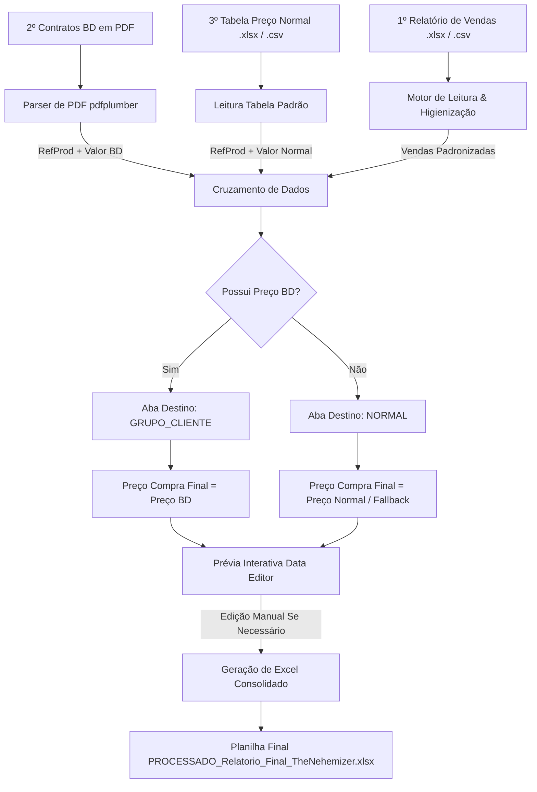

# 🎸 The Nehemizer - Portal Financeiro Saavedra N3

> *“O peso justo e a organização perfeita para os seus contratos financeiros.”*  
> *(Inspirado em Provérbios 11:1 e na gestão administrativa de Neemias).*


[](https://the-nehemizer.streamlit.app/)


---

## 📌 Visão Geral do Projeto

> 🌐 **URL do Sistema em Produção:** [https://the-nehemizer.streamlit.app/](https://the-nehemizer.streamlit.app/)

**The Nehemizer** é uma aplicação web desenvolvida em **Python + Streamlit** projetada para automatizar, equalizar e consolidar o fluxo de vendas e contratos financeiros de materiais hospitalares da **Saavedra N3**.

A ferramenta elimina o trabalho manual repetitivo ao cruzar relatórios brutos de vendas (Excel/CSV), propostas e contratos vigentes da **Becton Dickinson (BD)** extraídos de arquivos PDF, e tabelas de preços padrão, gerando relatórios financeiros auditáveis no formato Microsoft Excel (`.xlsx`).

---

## ✨ Principais Funcionalidades

- 📄 **Leitura Inteligente de Vendas:** Detecção automática da linha de cabeçalho em planilhas de vendas heterogêneas e padronização automática de nomes de colunas (`REFPROD`, `DESCRICAO`, `QTDCOM`, `VLRTOTAL`, `RAZAOSOCIAL`, `CONVENIO`).
- 📑 **Parser Automático de PDFs (Contratos BD):** Varredura OCR/texto de propostas comerciais em PDF para extração dinâmica de produtos (`REFPROD`) e seus respetivos valores tabelados (`VALOR_TABELADO_BD`).
- ⚖️ **Regra Suprema de Contingência:** Classificação automatizada onde produtos cadastrados em contrato BD mantêm seu valor tabelado e aba específica, enquanto produtos fora de contrato são direcionados de forma transparente para a aba `NORMAL`.
- ✏️ **Prévia Editável em Tempo Real:** Interface web com tabela interativa (`st.data_editor`) que permite a revisão e complementação manual de preços pendentes antes da exportação final.
- 📊 **Exportação Consolidada em Excel (XlsxWriter):**
  - **Aba RESUMO:** Visão executiva agrupada por contrato/cliente com calculo de preço unitário de venda, valor total de venda, valor unitário de compra e valor total de compra, além de subtotais acumulados.
  - **Abas Individuais por Cliente:** Detalhamento item a item das vendas por cliente/contrato + tabela resumo por produto com subtotal geral.
  - **Estilização Corporativa:** Aplicação automática do padrão visual Saavedra (Laranja `#F37021` e Grafite `#333333`) com formatação monetária nativa `R$ #,##0.00`.

---

## 🏛️ Arquitetura do Processamento



---

## 📋 Tabela de Mapeamento de Contratos & Clientes

O sistema agrupa e identifica automaticamente parceiros e números de contratos cadastrados conforme a tabela abaixo:

| Cliente / Instituição | Termos Reconhecidos (Filtro) | Código do Contrato BD | Aba de Destino por Padrão |
| :--- | :--- | :--- | :--- |
| **UNIMED** | `UNIMED`, `87096616` | `450128261` | UNIMED |
| **PUC** | `UNIAO BRASILEIRA`, `PUC`, `88630413` | `450155842` | PUC |
| **H DIVINA** | `DIVINA`, `87317764` | `450146829` | H DIVINA |
| **HCPA** | `CLINICAS`, `87020517` | `450139832` | HCPA |
| **SMS POA** | `PORTO ALEGRE` + (`PREF`/`MUNICIPIO`/`92963560`) | `450120243` | SMS POA |
| **EBSERH** | `EBSERH`, `SERVICOS HOSPITALARES`, `15126437` | `450098658` | EBSERH |
| **HCAA** | `ASTROGILDO`, `95610887` | `450137626` | HCAA |
| **GHC / CONCEIÇÃO** | `GHC`, `CONCEICAO`, `CONCEIÇÃO`, `450166419` | `450166419` | GHC / CONCEICAO |
| **SANTA CASA** | `SANTA CASA` | *Consolidado* | SANTA CASA |
| **OUTROS / SEM BD** | Produtos sem correspondência de preço BD | `NORMAL` | `NORMAL` |

---

## 🛠️ Tecnologias Utilizadas
- **Linguagem:** [Python 3.11+](https://www.python.org/)
- **Interface Web:** [Streamlit](https://streamlit.io/)
- **Manipulação de Dados:** [Pandas](https://pandas.pydata.org/) & [NumPy](https://numpy.org/)
- **Leitura de PDFs:** [pdfplumber](https://github.com/jsvine/pdfplumber)
- **Geração e Formatação de Excel:** [XlsxWriter](https://xlsxwriter.readthedocs.io/) & [OpenPyXL](https://openpyxl.readthedocs.io/)

---

## 💻 Como Executar o Projeto

### Pré-requisitos
- Python 3.10 ou superior instalado.
- Gerenciador de pacotes `pip`.

### 1. Clonar o Repositório
```bash
git clone https://github.com/seu-usuario/The-Nehemizer.git
cd The-Nehemizer
```

### 2. Criar e Ativar Ambiente Virtual (Recomendado)
- **Windows (PowerShell):**
  ```powershell
  python -m venv .venv
  \.venv\Scripts\Activate.ps1
  ```
- **Linux / macOS:**
  ```bash
  python3 -m venv .venv
  source .venv/bin/activate
  ```

### 3. Instalar Dependências
```bash
pip install -r requirements.txt
```

### 4. Executar a Aplicação
```bash
streamlit run app.py
```
A aplicação abrirá automaticamente no seu navegador em `http://localhost:8501`.

---

## 🐳 Execução via VS Code DevContainer / Codespaces

Este repositório possui suporte nativo ao **VS Code DevContainers** e **GitHub Codespaces**.

1. Certifique-se de ter o Docker e a extensão *Dev Containers* instalados no VS Code.
2. Abra a pasta do projeto no VS Code e selecione **"Reopen in Container"**.
3. O ambiente instalará as dependências automaticamente e iniciará a aplicação na porta `8501`.

---

## 📂 Estrutura de Arquivos

```
The-Nehemizer/
│
├── .devcontainer/
│   └── devcontainer.json   # Configuração para desenvolvimento em contêineres
├── .vscode/
│   └── settings.json       # Configurações do VS Code
├── .gitignore              # Regras de exclusão de arquivos temporários e caches
├── app.py                  # Código fonte principal (Interface + Regras de Negócio)
├── CONFLUENCE.md           # Documentação corporativa formatada para Confluence
├── README.md               # Documentação técnica e guia do desenvolvedor
└── requirements.txt        # Lista de dependências Python
```

---

## 🤝 Guia de Contribuição e Git Workflow

Ao efetuar alterações e melhorias no projeto:

1. **Atualizar a branch local:**
   ```bash
   git pull origin main
   ```
2. **Criar uma branch de feature/hotfix:**
   ```bash
   git checkout -b feature/nova-funcionalidade
   ```
3. **Fazer o commit com mensagens claras:**
   ```bash
   git add .
   git commit -m "feat: adiciona suporte a novos contratos BD"
   ```
4. **Enviar para o repositório remoto:**
   ```bash
   git push origin feature/nova-funcionalidade
   ```

---

## 👨‍💻 Autoria & Suporte Técnico

Para dúvidas arquiteturais, solicitações de alterações ou suporte técnico nesta solução:

- **Desenvolvedor Principal:** Jonatan Severo
- 📧 **E-mail de Suporte:** [suporte.saav@saavedra.com.br](mailto:suporte.saav@saavedra.com.br)
- 💼 **Perfil Profissional LinkedIn:** [linkedin.com/in/jonatanfsevero](https://www.linkedin.com/in/jonatanfsevero/)
- 🏢 **Unidade de Negócio:** Saavedra Suporte Web

---

## 📄 Licença e Propriedade

Desenvolvido para uso exclusivo e corporativo da **Saavedra N3**.  
Todos os direitos reservados.
